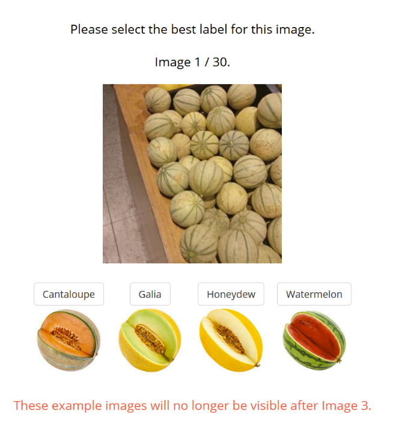
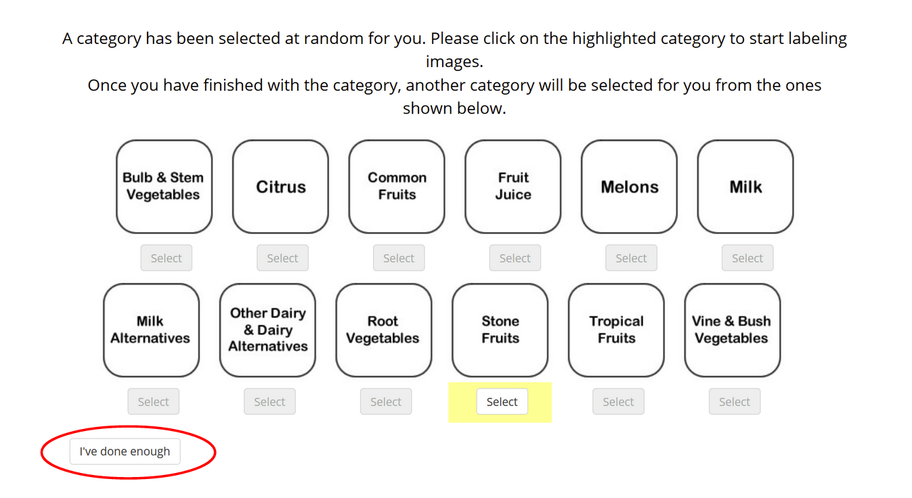
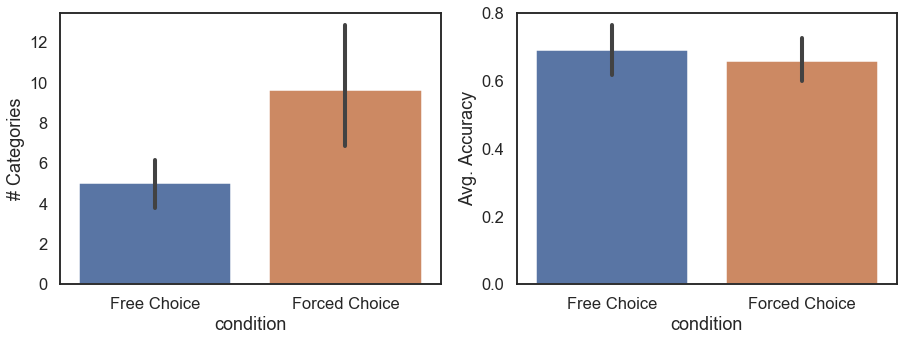
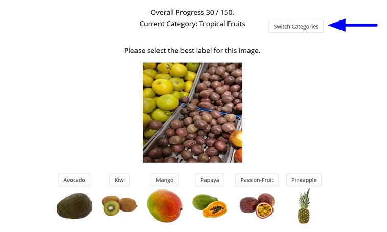
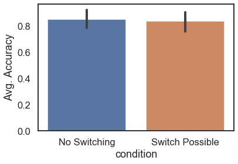

When scientists usually run human behavioral experiments, especially online, the researcher has total control over the experiment flow and the participant simply reacts to the stimuli presented. This works well enough, but we wondered whether giving participants more agency during the experiment would have an effect on their engagement and performance on the task. To investigate this we devised a series of classification tasks where, depending on the task, participants are allowed to choose the category of images that they label, the number of images in each category to label, or even when to quit the experiment. The accuracy and number of images classified of participants who are given agency is compared to those of participants who aren’t given any agency and go through a “traditional” version of the task, where the length of the experiment and all of the stimuli are decided in advance. Should we find an effect on task performance due to agency, then we believe that this finding would have implications not only for behavioral research design, but also for how tasks are structured and delegated in the workplace.

We ran two online experiments to investigate the effect of agency on task engagement and performance. In both experiments, participants were asked to label images of common grocery store items such as produce and dairy. These images were grouped into 12 categories such as citrus fruits, root vegetables, fruit juice, and dairy substitutes. Before the classification task began, participants were able to practice on some example images, allowing them to familiarize themselves with the interface and task.

In the first experiment, participants were either put in the free choice condition, where they could choose the category of images they wanted to classify, or the forced choice condition where the categories were selected for the participant. In both conditions, participants had the option to quit the experiment whenever they wanted after going through one category’s worth of images. We hypothesized that those in the free choice condition would complete more categories and also have higher classification accuracy compared to those in the forced choice condition, due to being more engaged in the task.

We found the opposite, where people in the forced choice condition completed more categories than those with the freedom to choose, and that classification accuracy was similar between both groups. Perhaps the participants with freedom to choose felt more empowered to end the experiment early or perhaps those who weren’t given any freedom expected the experiment to end on its own accord, like so many other traditional online experiments. We decided to get rid of the option to quit for the next experiment, since it seemed to confuse some participants.

In the second experiment, we again had free choice and forced choice conditions, except this time every participant would classify the same number of images. The freedom allowed to some participants in this case was to change the category of images whenever they desired, whereas those in the forced choice condition would only stay in one category for the whole experiment. We hypothesized again that those who had the choice to switch categories would have higher classification accuracy compared those who had no choice because we thought that those who had no choice would get bored faster and that would affect accuracy. 

Again, we found that the accuracy between both conditions was similar. It is possible that the task was too short to allow for boredom to set in properly, or that even given choice, the task wasn’t engaging enough to have an effect on performance. 

To further investigate the effects of agency on performance, it might be useful to run longer, possibly longitudinal, experiments to see if one group is more willing to complete the classification task compared to the other. Or, it might be helpful to use a different task entirely, perhaps one where having choices makes a significant difference in user experience compared to not having choices. While we hoped to find a new way of designing effective behavioral experiments, as it stands, the question remains as to whether giving participants agency improves their performance on an experiment.
